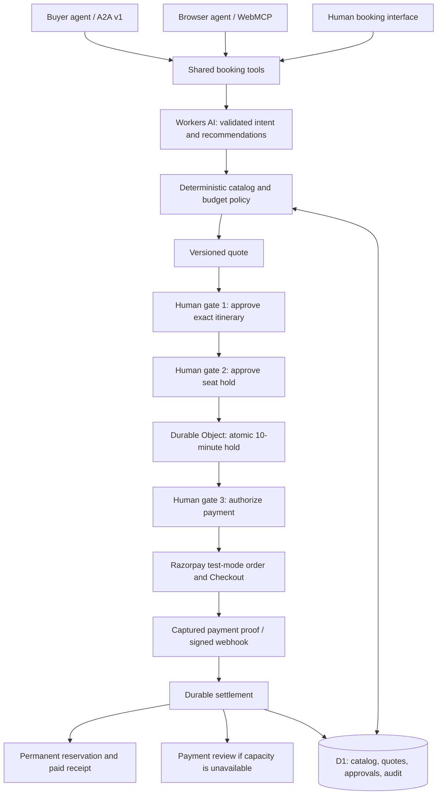

# T-Bud architecture

T-Bud exposes one booking engine through a human interface, A2A v1 and WebMCP. Workers AI proposes structured intent and catalog add-ons. Deterministic services own price, budget, authorization, capacity and settlement.

## Boundaries

- Explicit group sizes and total INR ceilings are parsed deterministically. Model output is schema-validated, with a deterministic fallback and actionable errors for unclear critical inputs.
- Prices originate in the D1 catalog and use integer paise. Over-budget quotes cannot advance to consequential actions.
- Each human approval matches a quote, version, digest and browser session. An agent cannot substitute a different quote after approval.
- Durable Objects serialize capacity changes. A temporary hold expires; a captured-payment reservation persists.
- Checkout recovery checks the server receipt and the active hold and reuses the existing approved order.
- Checkout verification confirms the HMAC proof and authoritative captured payment. Webhooks verify the raw-body HMAC, event identity, amount and currency.
- Settlement completes before a webhook receives a successful acknowledgement. Retries preserve the recorded booking outcome rather than consuming capacity again.
- A captured payment without capacity is recorded for merchant review, never represented as a confirmed booking.

## Verification and scope

The validation set comprises 66 unit/UI tests, 44 Worker integration tests and seven browser E2E tests. Cases include separate human approvals, budget rejection, capacity conflicts, persistent paid seats, late payments, duplicate delivery and checkout reload recovery. The primary routes have responsive checks at 360, 768, 1024 and 1440px, plus axe checks for serious and critical accessibility violations.

A deployed Razorpay test payment has been independently checked as captured, with its D1 settlement source recorded as `webhook`. No real payment is collected by this pilot. Inventory is seeded merchant data, not an external tour-operator integration. Adoption and revenue impact have not been measured.
